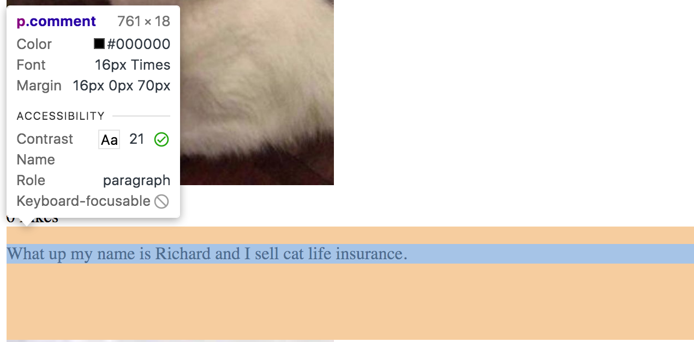
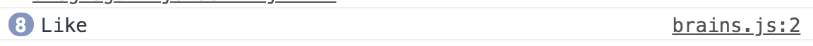

# Catstagram  
A full-stack of a web-based application, modeled after Instagram but with cats. 

## First, Answer This Question
*Start here young padouan and riddle us this question:*
* Do you use Instagram, Twitch, or Soundcloud, or any other web application? Do you *actually* know how they work? **PAUSE.**
* If the answer was *"No,"* that's okay. Even though over a billion people use these applications, 99.9%
of them don't either. **We want you to be in that .1%** of 
people that can explain to your friends and family exactly how every web-based project works, front to back. 

## How?
*How are you going to learn how web applications work?*
* You are going to learn by **building your own version of Instagram**, except only with
pictures of...cats.

## Why?
*Why you should want to know how web-based applications work:*
* You are alive in 2021, right!? The internet has already changed the way you live, learn, work, think, and play, right?! 
* Whether you choose to pursue a career building world-changing software or you become a musician, knowing how applications
work will open up an entirely new world to you, while also making you a more engaged, thoughtful member of society. 

## Part I: Things to Know

### INTERNAL TODO: A Universal Diagram

### File Structure / File Tree
INTERNAL TODO: Insert picture of file structure from gitpod
* This project, like most projects, has its own folder, that contains the following:
    * **index.html page:**
        * This is the page that the browser loads and is the file that you should preview when you want to see an application
    * **brains.js**:
        * This is the javascript file, the brains of the operation.
    * **favicon.ico**
        * This is the icon that appears on the tab in the browser. It stands for "favorite icon"

### What is Github and Why/How Do you use it? 

#### What is Github?
 * Just like you save your work in Google Drive for school, software developers save their code in something called
 Github. 
 * When we did setup for this class, you created a repository for your code to live. You can think of a repository (repo for short),
 as a folder or locker for your code. 
 * Inside the locker, you put all of the files, images, and graphics you need to run
 your application. 
 #### Why do you use it?
 * Just like when you build a house, you can have multiple people working at the same time - painting, hanging drywall, etc - you can do the same thing with code.
 * It's important that everyone working on software be able to save their work in one place, so that everyone
 can know what progress has been made. 
 * Github allows developers to save their code so that everyone can see it, just like Google Drive.
 ####When do you use it?
  * When you are ready to take a project live so that it will show up on your portfolio website, you will follow the instructions below.
  
 #### How do you use it?
 * First, go to Window > New Terminal in Gitpod. 
    * This will open up the terminal or bash window, which allows
 you to talk directly to your computer. Believe it or not, the first computer was just this window!
 * Once the terminal is open, you are going to run three different commands, pressing enter after each one. 
 * The first command: 
    * ```git add .  ``` then hit Enter. Don't forget the ```.```
    * ```git commit -m 'insert specific message about what you are saving'``` 
    This second command can be tricky.You want to write a message inside the qoutation marks that describes what you are changing. 
    Think of this as a sticky note message. Press Enter. 
    * ```git push``` then press Enter. 
 * If you successfully ran these commands one at a time, your terminal window should look like this:
 

 
 
## Part II: Preview index.html + Check for errors
Below you will find instructions on what TODO to build Catstagram. Take each bulletpoint one by one. Work in Google Chrome. 
There are **nine** TODOs in Part I. Complete each one!


#### TODO #1: Investigate/Preview Index.html file
    a) Open the index.html file in Gitpod and look it over
    b) Ask the questions:
        * Do I know what each of these lines of html do?
        * What should I expect to see when I preview this file? *Hint: What's inside the body tag?*
        * Do I see any errors, any opening tags or closing tags that are wrong?
    c) Right click on the file index.html and click "Preview with LiveServer" or "Preview"
    d) Ask the question: 
        * Was I right? Am I seeing what I expected to see?
    e) Fix the errors in the html


## Part II: Build The Structure of Catstagram with HTML
Next you will build the structure of Catstagram so that you and your users can start to get value
from the applicaiton, i.e. see pics of cats!

#### TODO # 4: Add Basic HTML
    a) Open the "index.html" file in the file tree
    b) Inside the   <body> </body>  add an  <h1></h1>  and name the site "Catsagram"
    c) Below the h1 title, add an <h5></h6> and add the caption "Sharing the World's cats" 
    d) Save your work in Gitpod
    e) Return to Chrome and refresh the page. You should see a title and tagline for Catstagram

    
    
#### TODO #5: Add One Cat Image from a Source URL
    a) Create an  tag with an attribute
    b) Add an attribute inside the opening  tag for 'src'
    c) Search Google for an image of a cat, right click on the image, and select "copy image address"
    d) Inside the opening    tag, find the  'src'  tag and paste the url of the cat image so that 
    it looks like this  src="https://i.pinimg.com/originals/3b/4f/55/3b4f55f606f04ed5300d1bcf589c010e.jpg"
    e) Make sure this url ends in either .png or .jpg
    f) Save your work in Gitpod
    g) Return to Chrome and refresh the page. You should see your image on the website
 
#### Investigate and Discuss

Next, we are going to investigate an Instagram post and determine what else needs to be added
*What else is associated with each photo? Where is each element located? Investigate so you know how to build Catstagram*

* Look at the photo below
* Notice the different elements associated with each photo:
    * A # of Likes
    * A caption


    
        
        
#### TODO #6: Add Like Count and Caption underneath the photo
    * Underneath the    tag, add a  <p></p>  with '0 Likes' in it
    * Underneath the    tag, add a  <p></p>  with a caption. Get creative!
    * Save your work in Gitpod
    * Return to Chrome and refresh the page. You should see a like count and a caption underneath the photo

#### TODO #7: Add 4 More Cat Pics with Like Count and Captions
    * Underneath the image, like count, and caption, add four more images following the same steps as above, make sure each
    photo has a like count and caption!
    * Each time you add a photo, save your workspace in Gitpod, and you should see your cat images, like counts, and captions show up in a column just like Instagram
    
#### TODO #8: Review your work and check for errors
A good developer always reviews his work before she commits it. Don't worry, you'll learn what a commit is in a second. For now, 
review all of your work and check for the following:

    * Correct indentation
    * Opening and closing tags (except for img tag)
    * Spelling/grammer mistakes
    * All 5 images are showing up
    * All TODOs are complete

    
#### TODO #9: Push your code to Github
* First, open a terminal window by clicking at the top Window > New Terminal
* Then run each of the following commands one by one:
    * ```git add .  ``` then hit Enter. Don't forget the ```.```
    * ```git commit -m 'insert specific message about what you are saving'``` 
          This second command can be tricky.You want to write a message inside the qoutation marks that describes what you are changing. 
          Think of this as a sticky note message. Press Enter. 
    * ```git push``` then press Enter. 
    * If you successfully ran these commands one at a time, your terminal window should look like this:
       

## Part I and II Review Questions
* What is the file tree?
* What is a favicon?
* What does it mean to "inspect the page"? How do you get to the console of a page?
* What does src stand for?
* What is Github? What are the commands to add your code

## Part III: Make Catstagram Look Modern
Now that you have 5 photos of cats on your Catstagram, let's take a step back and ask ourselves a question: 
**Does this site look like a modern web application? Does it look like applications that I like to use?** Notice, the question is not - does the site look ***good***? This is subjective. 
Beauty is in the eye of the beholder. Discuss for a minute. 

#### Investigate and Discuss
We have already done some coding. From the options below, what have we built so far? 

1. Javascript
2. Database
3. HTML
4. CSS
5. All of the Above

Yes, we have already built the **structure and content** of the website, the HTML.
Next, in order to make the site look pretty, from the list above what language are we going to use? 
 
#### TODO #10: Add Style Tags in the Head
In order to start adding CSS, we have to add ```<style> </style>``` tags into the head of 
our ```index.html``` file. Inside of the opening and closing ```style``` tags, we'll put all of the CSS rules
that will make Catstagram look modern. 

    a) Locate the  <head>  tag
    b) Locate inside the  <head>  tag and underneath the  <script></script>  tag
    c) Add an opening and closing  <style></style>  tags
    d) Now, "open up" the <style> tag by putting your cursor in between the opening and closing tags
    and pressing enter. It should look like this: 

    
    e) Save your work in Gitpod

 
#### TODO #11: Style the Title and Subtitle

    a) Inside the inside the  <style>  tag, add a class called "brand-font" that has one property 
    of font-style with a value of 'italic'. Don't forget the semi-colon!
    b) Add that class inside the opening tag of your <h1> and <h5> tags
    c) Save your work in Gitpod
    d) Return to Chrome and refresh the page. You should see your Title and Sub-title in italics

#### TODO #12: Style the Images

    a) Inside the inside the  <style>  tag, add a CSS rule for all  tags that makes all images the same width:
        * Selects a property of "width"
        * With a value of 300px
    b) Save your work in Gitpod
    c) Return to Chrome and refresh the page. You should see all of your pics have the same width

#### TODO #12: Add Some Space Underneath the Captions
When you look at your Catstagram, it is kind of hard to tell which captions
are with which photos. In order to make this more clear, we're going to add some 
space underneath each of captions. 

    a) Inside the inside the <style> tag, add a class called "comment". Don't forget the period before
    the class name!
    b) The class `.comment` should set the following rule:
               margin-bottom: 70px
    c) Save your work in Gitpod
    d) Return to Chrome and refresh the page. You should see space underneath all of your comments
    
    
#### TODO #13: Open the Console and Select an Element
When we are working with CSS, it is really helpful to use the Developer Tools to experiment 
with different styles. In order to do this, follow the steps below:

    a) Right click the page and select "Inspect"
    b) Click on the icon in the top left corner of the Inspect Tools window. When
    you have selected it, it will turn blue like below:


    c) Once that icon is blue, hover over the caption on your Catstagram page. It
    will turn a different color, like below:


    d) Click on the caption and then look in the bottom section of the 
    Developer Tools. You should see your css rule called .comment, like below:


    e) Now click on the property value, where it says "70px" and using your up and down arrow keys,
    play around with the value while observing what is happening on your page. 
    f)Refresh the page. Notice, did your changes stick?
    
#### TODO #14: Center all of the content on the page
Right now, all of the content is squished over to the left side of the page, right?
We want to center everything, so that the images, like count, and caption are in the center of the page.
In order to do this, we're going to put everything inside of a  ```<div></div>``` and then we're going to add some 
style rules to that ```<div>```

    a) Below the <h5>, add an opening <div>
    b) After the the caption of your LAST photo, add the closing tag </div>
    c) Highlight everything inside the opening and closing <div> </div> tags, and press indent,
    so that it is clear to see that the <div> is the parent tag of all of this content. 
    d) Next, add a class to the opening tag of the <div> called "pic-container" 
    e) Add a rule in the <style></style> tag in the <head> that looks like this:
    
        
       .pic-container {
            display: flex;
            flex-direction: column;
            align-items: center;
        }
        
    
#### TODO #15: Review your work and check for errors
A good developer always reviews her work before she commits it. Review all of your work and check for the following:

    * Correct indentation in the CSS rules
    * Ensure the page looks like it is supposed to look:
        * Title/subtitle are italicized
        * Images are the same width
        * There is space under each caption
        * All content is centered
    images are centered
    * Semi-colons at the end of each property
    * All TODOs are complete
    
    
#### TODO #16: Push your code to Github
    * First, open a terminal window by clicking at the top Window > New Terminal
    * Then run each of the following commands one by one:
        * ```git add .  ``` then hit Enter. Don't forget the ```.```
        * ```git commit -m 'insert specific message about what you are saving'``` 
              This second command can be tricky.You want to write a message inside the qoutation marks that describes what you are changing. 
              Think of this as a sticky note message. Press Enter. 
        * ```git push``` then press Enter. 
        * If you successfully ran these commands one at a time, your terminal window should look like this:
           
        * Checkout the live site on your portfolio and make sure the changes are appearing.
    

## Part IV: Give Catstagram Some Functionality

#### Investigate and Discuss
We're making progress. From the options below, what have we built so far? 

1. Javascript
2. Database
3. HTML
4. CSS
5. All of the Above

Yes, we have already built the **structure and content** of the website, the HTML, and we have **styled** it using CSS. 
Next, in order to make the site have functionality, from the list above what language are we going to use? 

#### TODO #17: Add A Heart Button above the caption of the First Photo
    a) Above the <p> 0 Likes </p> add a button element:
        <button> Heart </button>
    b) Save your work on Gitpod
    c) Return to Chrome and confirm that you have a button with the word "Heart" on it below your first photo.

#### TODO # 18: Open the Developer Tools, Navigate to Console tab
    a) Right click the page and select "Inspect"
    b) Choose the tab labeled "Console"


#### TODO #19: Find/Fix the Errors
    a) Read the error, find what line the error is on, click on the link to the brain.js file
    b) Go back to Gitpod, remove the error so that the javascript file is empty.
    c) Save your work in Gitpod by typing "Ctrl S" or File > Save
    d) Return to Chrome and refresh the page. Recheck the console for errors. You should see a no more error on line 1 of brain.js.
    
    
#### TODO #20: Make the Button DO Something, Part 1
As you get deeper into Javascript, you'll learn more about different ways to 
connect the HTML and Javascript together, including learning about frameworks that make this 
easy. For now, we're going to add a simple onClick function into the opening tag of the ```<button>```

    a) Inside the opening <button> tag, add the following code:
         onClick="likePhoto()"
    b) Confirm that the button element now looks like this:
         <button onClick="likePhoto()">Heart</button>
    c) Save your work in Gitpod
    
#### TODO #21: Add A Heart Button to EVERY Photo
Now that you've added some functionality to the button, copy and paste it for each of your
five photos. 

    a) Above the <p> 0 Likes </p> add a button element to every photo:
         <button onClick="likePhoto()">Heart</button>
    b) Save your work on Gitpod
    c) Return to Chrome and confirm that you have a button with the word "Heart" on it below every photo.

#### TODO #22: Make the Button DO Something, Part 2
Now that we've added this function to the opening tag of the button, we need to 
write the function called  ```likePhoto``` in the brain.js file

    a) Navigate to brain.js in Giptod
    b) Write a function called "likePhoto" that prints the word "Like" to the console.
    c) Save your work in Gitpod
    d) Navigate to Chrome, inspect the page, open the console and test the function!
    e) You should see the word "like" printed to the console each time you press the button, like this:
  
   

    

#### TODO #23: Create a variable to store the number of likes!
Now that we have a function that is working, we need to modify our javascript so that 
it keeps track of the number of likes on each photo. How can we do this?

    a) Above your likePhoto function, add a variable called "likeCount" and give it a value of zero 
    b) Modify your likePhoto function so that it increases the likeCount by one each time the function is called
    c) Instead of printing "like" to the console, now print the likeCount variable. 
    c) Save your work in Gitpod
    d) Return to Chrome and open the console to see if likeCount is increasing.
    
    
   
#### TODO #24: Review your work and check for errors
A good developer always reviews her work before she commits it. Review all of your work and check for the following:

    * Correct syntax in javascript
    * Ensure the like button performs how it should
    images are centered
    * No errors in the console
    * All TODOs are complete
    
    
#### TODO #25: Push your code to Github
    * First, open a terminal window by clicking at the top Window > New Terminal
    * Then run each of the following commands one by one:
        * ```git add .  ``` then hit Enter. Don't forget the ```.```
        * ```git commit -m 'insert specific message about what you are saving'``` 
              This second command can be tricky.You want to write a message inside the qoutation marks that describes what you are changing. 
              Think of this as a sticky note message. Press Enter. 
        * ```git push``` then press Enter. 
        * If you successfully ran these commands one at a time, your terminal window should look like this:
           
        * Checkout the live site on your portfolio and make sure the changes are appearing.


## Part III and IV Discussion Questions
* What is the “frontend” of a web application? What does the “frontend” consist of?
* Where do the “likes” and “comments” get stored after you print them? If you refresh your browser window, do they disappear?
* Where are the photos in your instagram feed coming from? Are they being served locally or are they being fetched from a database? Why?


